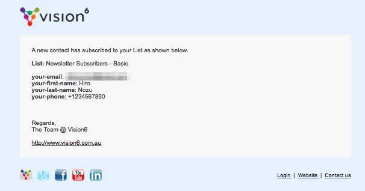

# Contact Form 7 Vision 6

*Subscribe to Vision 6 upon Contact Form 7 Submission*

- Enables you to spend time with S/CSS files only for Contact Form 7.
- It is for Contact Form 7 so that you can avoid the restriction of Vision 6 Plugin using IFRAME Tag.

## Requirement

Contact Form 7 Version 4.4 or later. You can still put extra code in `functions.php` by referring the code in `wpcf7-vision6.php` even if the version does not match.

## General Setup

1. Create a Form with Contact Form 7 ([Extra Setup](#extra-setup)).
2. [Install this plugin and activate it](#installation).
3. [Get Vision 6 API Key](http://www.vision6.com.au/integration/api_keys/).
4. Create a List at Vision 6.
5. Create a Form for the List at Vision 6 ([About Field Mapping](#field-mapping)).
6. Open a Contact Form 7 Setting at WordPress.
7. Open `Additional Settings` Tab.
8. Do what `Vision 6 Info` Section says.

## Installation

### Method 1 (Use WP-CLI)

```shell
$ wp plugin install https://github.com/hironozu/wpcf7-vision6/archive/master.zip --activate
```

### Method 2 (Use Zip File)

1. [Download Zip file from GitHub](https://github.com/hironozu/wpcf7-vision6/archive/master.zip).
2. Go to `Plugins > Add New` and click `Upload Plugin`.
3. Upload the Zip file and activate the plugin.

## Example Setting at "Additional Settings" Tab

- If you wish to store the data with a 3rd party plugin, do not include `do_not_store`.
- If you wish to send the email upon submission, do not include `skip_mail`.
- If the form does not have the consent, do not include `acceptance_as_validation`.

```
vision6_api_key: [Get at https://www.vision6.com.au/integration/api_keys]
do_not_store: true
skip_mail: on
acceptance_as_validation: on
vision6_list_id: 123456 (Newsletter)
```

## Extra Setup

### reCaptcha

reCaptcha is useful to avoid SPAM.

[How to set up reCaptcha for Contact Form 7](https://contactform7.com/en/recaptcha/)

### Consent

If you need to show a checkbox and the subscriber must have it ticked, this feature is useful.

[Acceptance Checkbox](https://contactform7.com/acceptance-checkbox/)

### Example Setup at "Form" Tab

```html
[email* your-email placeholder "Email"]

[text* your-first-name placeholder "First Name"]

[text your-last-name placeholder "Last Name"]

[text* your-phone placeholder "Mobile"]

[acceptance your-consent]I consent to the <a target="_blank" href="#">conditions</a>.[/acceptance]

<div class="mb-3">[recaptcha]</div>

[submit "Subscribe"]
```

## Field Mapping

This plugin automatically maps the fields between Contact Form 7 and Vision 6 as assuming they both have the same field names. So if Contact Form 7 has the field `your-email`, the field `Field Name` at Vision 6 must be `your-email`:


The behaviour above makes the email sent to Vision 6 Admin have `your-email` instead of the value of `Field Display Name`.



If that is not acceptable or you cannot be bothered at matching up the fields between Contact Form 7 and Vision 6, you can add the following code to `functions.php` and amend the code to map the fields:

```php
function my_wpcf7vision6_get_contact_details($contact_form, $api) {
    $submission = WPCF7_Submission::get_instance();
    $posted_data = $submission->get_posted_data();
    return [
    //  'Field Name at Vision 6' => $posted_data['Field Name at Contact Form 7']
        'Email' => $posted_data['your-email'],
        'First Name' => $posted_data['your-first-name'],
        'Last Name' => $posted_data['your-last-name'],
        'Mobile Phone' => $posted_data['your-phone'],
    ];
}
add_filter('wpcf7vision6_get_contact_details', 'my_wpcf7vision6_get_contact_details', 10, 2);
```
